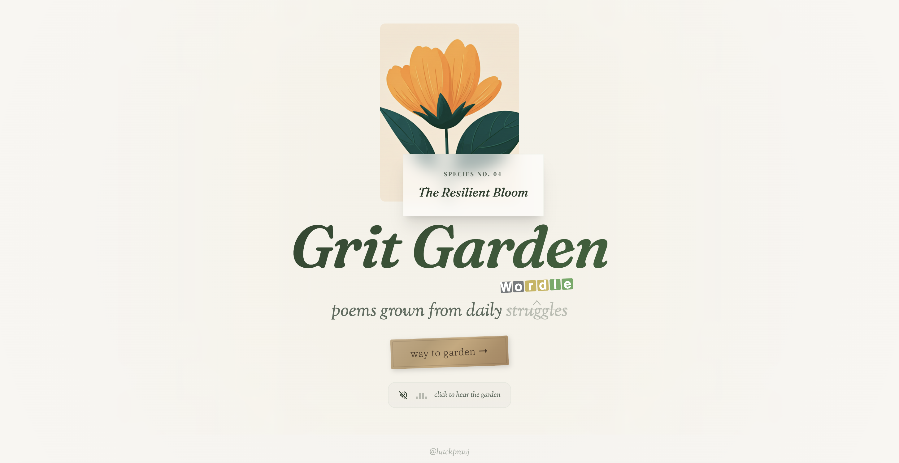
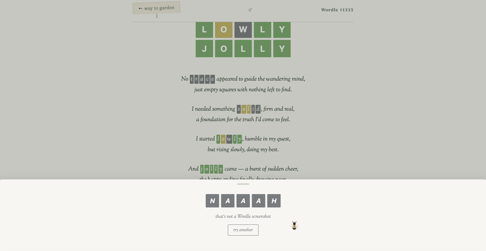

<p align="center">
  
</p>

# Grit Garden

poems grown from daily ~~struggles~~ Wordle

A personal art project that transforms daily Wordle attempts into poetry and visual flowers.

Each game becomes a bouquet in a growing garden; green petals for correct letters, yellow for misplaced ones. The emotional arc of every game (confusion, partial clarity, near-miss, resolution) is mapped onto a poem, one stanza per guess.

**[grit.garden](https://grit.garden)**

## How it works

Every day a GitHub Action pipeline runs:

1. Claude plays today's Wordle (numbed down to average human player level)
2. Writes a poem; one stanza per guess, sentiment mirrors the game's emotional arc
3. Generates a flower cluster whose green/yellow petal ratio reflects performance
4. Commits the new entry and the flower joins the garden

## Grow your own poem

Users can upload their own Wordle screenshot directly on any poem page and grow a poem on the spot:

1. Tap "grow your poem" button
2. Upload or drag a Wordle screenshot
3. Claude scans the grid, identifies guesses
4. A poem grows from your game; same rules, your words
5. Your flower blooms alongside the original

<p align="center">
  
</p>

## The details

Every element is designed to feel like a real garden:

- **Flowers** — 6-petal SVG botanical illustrations, deterministic per date
- **Greenery** — Procedural eucalyptus and fern fronds behind each bouquet
- **Particles** — Falling petals, leaves with vein structures, dandelion seed puffs, golden pollen
- **Sound** — Ambient garden atmosphere with wind breathing and bee visits in bursts
- **The bee** — Wanders the page, perches on things, follows your cursor
- **Grass** — Wild meadow at page bottom with brown leaves and wildflower dots
- **Guess words** — Highlighted letter-by-letter in poems with their Wordle tile colors
- **The signpost** — Navigation styled as a wooden garden sign
- **The frown** — Mute the sound and the toggle frowns

## Stack

Vanilla HTML/CSS/JS. No frameworks, no build step, no dependencies. Poems generated by Claude. Hosted on Vercel.

## Local dev

```
npx serve .
```

## By

[@hackpravj](https://x.com/hackpravj)
